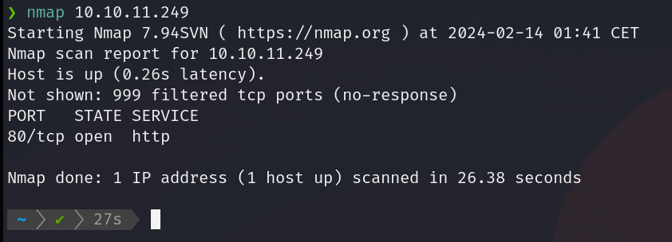
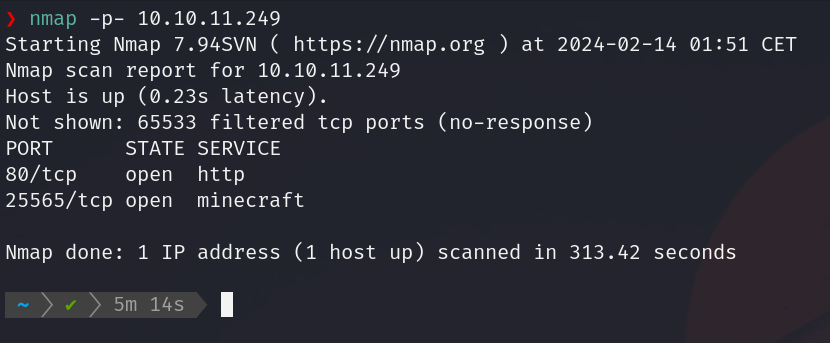
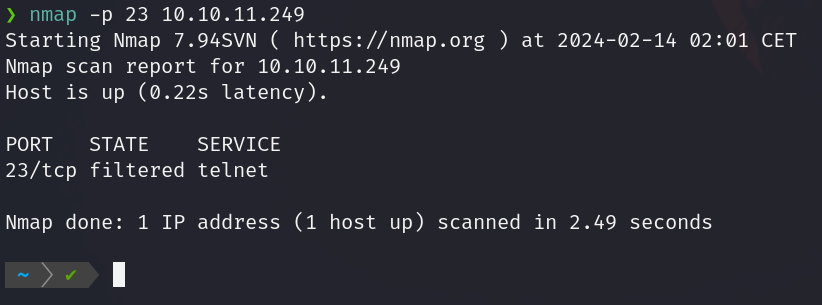

# Guia Nmap

### Introduccion
En esta guía, te introduciré a una herramienta fundamental: Nmap, que te ayudará a explorar y proteger redes, ya sea que estés dando tus primeros pasos en el mundo de la Ciberseguridad o estés buscando mejorar tus habilidades.

### ¿Qué es Nmap?
Nmap o "Network Mapper", es una herramienta de codigo abierto utilizada en el campo de la seguridad informatica. Es un escaner el cual permite descubrir hosts y servicios que esten disponibles en una red, asi como para detectar puertos abiertos, sistemas operativos e informacion sobre dispositivos conectados en una red wifi.

### Funciones Basicas de Nmap
- Descubrimiento de Hosts:
El descubrimiento de hosts es el proceso de identificar qué dispositivos están activos y disponibles en una red. Nmap utiliza varios métodos para descubrir hosts, incluyendo el envío de paquetes de sondeo ICMP, TCP y UDP, así como técnicas de barrido de direcciones IP.
- Escaneo de Puertos:
El escaneo de puertos implica la identificación de qué puertos están abiertos en un host objetivo. Los puertos abiertos pueden indicar la presencia de servicios en ejecución y son puntos de entrada potenciales para ataques.
- Detección de Servicios:
La detección de servicios implica identificar qué servicios específicos están disponibles en los puertos abiertos de un host. Nmap puede realizar la detección de servicios utilizando técnicas como la consulta de puertos específicos
- Detección de Sistemas Operativos:
Nmap intenta determinar el sistema operativo del host objetivo basándose en las respuestas recibidas durante el escaneo.
- Escaneo de Vulnerabilidades:
El escaneo de vulnerabilidades implica la identificación de posibles debilidades en los sistemas objetivo que podrían ser explotadas por un atacante. Mientras que Nmap en sí mismo __no es una herramienta de detección de vulnerabilidades__, puede proporcionar información útil que puede ser utilizada en conjunto con otras herramientas para realizar análisis de vulnerabilidades. Esto con ayuda de detección de versiones de servicios y la ejecución de scripts, ya que pueden utilizarse para realizar pruebas adicionales de seguridad, como la detección de servicios vulnerables o la exploración de configuraciones de seguridad deficientes.


### Comandos Básicos de Nmap
- Descubrir dispositivos conectados en una red
```cmd
nmap -sn 192.168.10.0/24

```
Este comando escaneará todas las direcciones IP dentro de la subred 192.168.10.0/24 y mostrará qué dispositivos están activos y disponibles en la red.

- Escaneo Básico de Puertos de un Host
```cmd
nmap 10.10.11.249

```
- Resultados:

<br>



- Escaneo a todos los puertos TCP de un Host
```cmd
nmap -p- 10.10.11.249

```
- Resultados

<br>



- Escaneo de un Puerto Específico
```cmd
nmap -p[Puerto] 10.10.11.249

```

- Ejemplo:

<br>


