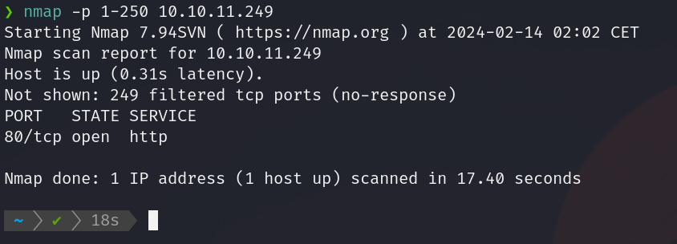
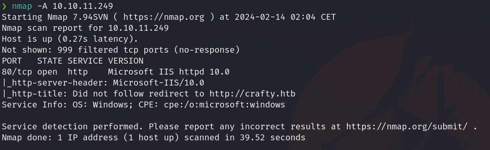
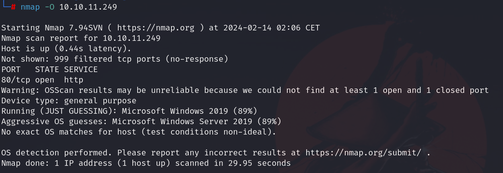
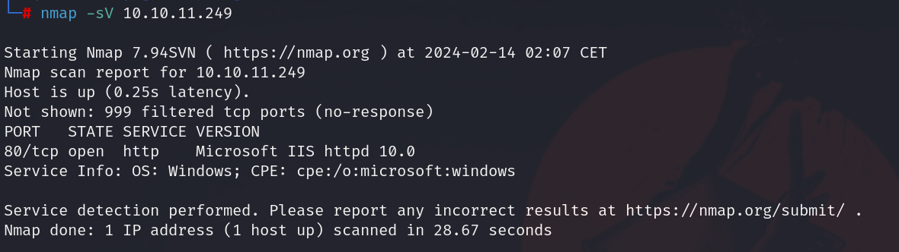
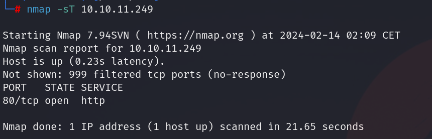
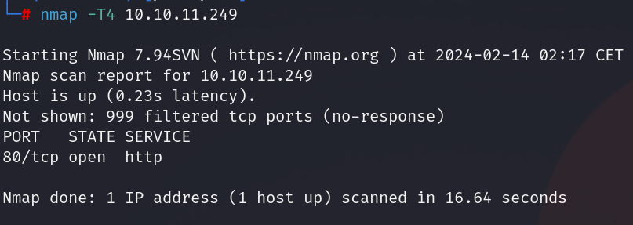
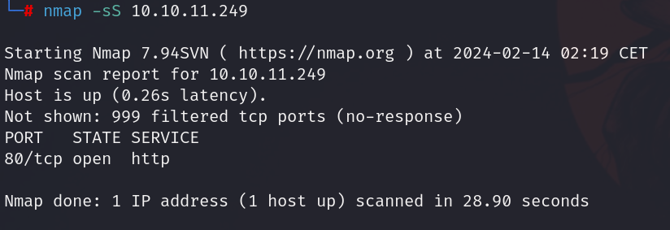
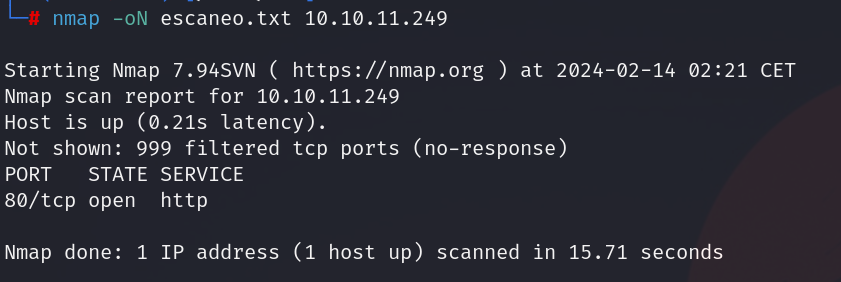
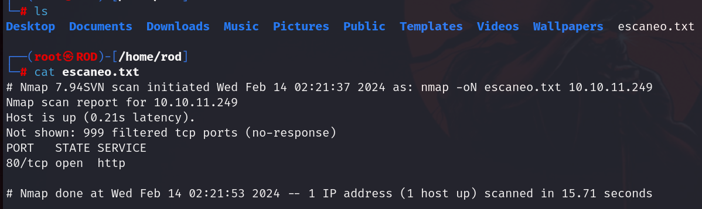

# Guia Nmap

### Introduccion
En esta guía, te introduciré a una herramienta fundamental: Nmap, que te ayudará a explorar y proteger redes, ya sea que estés dando tus primeros pasos en el mundo de la Ciberseguridad o estés buscando mejorar tus habilidades.

### ¿Qué es Nmap?
Nmap o "Network Mapper", es una herramienta de codigo abierto utilizada en el campo de la seguridad informatica. Es un escaner el cual permite descubrir hosts y servicios que esten disponibles en una red, asi como para detectar puertos abiertos, sistemas operativos e informacion sobre dispositivos conectados en una red wifi.

### Funciones Basicas de Nmap
- Descubrimiento de Hosts:
El descubrimiento de hosts es el proceso de identificar qué dispositivos están activos y disponibles en una red. Nmap utiliza varios métodos para descubrir hosts, incluyendo el envío de paquetes de sondeo ICMP, TCP y UDP, así como técnicas de barrido de direcciones IP.
- Escaneo de Puertos:
El escaneo de puertos implica la identificación de qué puertos están abiertos en un host objetivo. Los puertos abiertos pueden indicar la presencia de servicios en ejecución y son puntos de entrada potenciales para ataques.
- Detección de Servicios:
La detección de servicios implica identificar qué servicios específicos están disponibles en los puertos abiertos de un host. Nmap puede realizar la detección de servicios utilizando técnicas como la consulta de puertos específicos
- Detección de Sistemas Operativos:
Nmap intenta determinar el sistema operativo del host objetivo basándose en las respuestas recibidas durante el escaneo.
- Escaneo de Vulnerabilidades:
El escaneo de vulnerabilidades implica la identificación de posibles debilidades en los sistemas objetivo que podrían ser explotadas por un atacante. Mientras que Nmap en sí mismo __no es una herramienta de detección de vulnerabilidades__, puede proporcionar información útil que puede ser utilizada en conjunto con otras herramientas para realizar análisis de vulnerabilidades. Esto con ayuda de detección de versiones de servicios y la ejecución de scripts, ya que pueden utilizarse para realizar pruebas adicionales de seguridad, como la detección de servicios vulnerables o la exploración de configuraciones de seguridad deficientes.


### Comandos Básicos de Nmap
- Descubrir dispositivos conectados en una red
```cmd
nmap -sn 192.168.10.0/24

```
Este comando escaneará todas las direcciones IP dentro de la subred 192.168.10.0/24 y mostrará qué dispositivos están activos y disponibles en la red.

- Escaneo Básico de Puertos de un Host

```cmd
nmap 10.10.11.249

```
- Resultados:

<br>


Este comando realiza un escaneo de puertos básico en el host con la dirección IP 10.10.11.249.


- Escaneo a todos los puertos TCP de un Host
```cmd
nmap -p- 10.10.11.249

```
- Resultados

<br>


Este comando realiza un escaneo en todos los puertos del host con la dirección IP 10.10.11.249.


- Escaneo de un Puerto Específico
```cmd
nmap -p [Puerto] 10.10.11.249

```

- Ejemplo:

<br>


Este comando realiza un escaneo en un puerto específico en el host con la dirección IP 10.10.11.249.


- Escaneo de un Rango de Puertos
```cmd
nmap -p [Rango de Puertos] 10.10.11.249

```

- Ejemplo:




Este comando realiza un escaneo en un rango de puertos en el host con la dirección IP 10.10.11.249.


- Escaneo Agresivo
```cmd
nmap -A 10.10.11.249

```

- Ejemplo:

<br>



Este comando realiza un escaneo agresivo en el host con la dirección IP 10.10.11.249, que incluye detección de servicios, detección de sistemas operativos y scripts de detección de vulnerabilidades.


- Identificar Sistema Operativo
```cmd
nmap -O 10.10.11.249

```

- Ejemplo:

<br>



Este comando intenta identificar el sistema operativo del host con la dirección IP 10.10.11.249.


- Identificar versiones de los servicios
```cmd
nmap -sV 10.10.11.249

```

- Ejemplo:

<br>




Este comando intenta identificar las versiones de los servicios que se están ejecutando en el host con la dirección IP 10.10.11.249.

- Escaneo de tipo TCP

```cmd
nmap -sT 10.10.11.249

```

- Ejemplo:

<br>




Este comando realiza un escaneo de tipo TCP en el host con la dirección IP 10.10.11.249.


- Parametro -T4 

```cmd
nmap -T4 10.10.11.249

```

- Ejemplo:

<br>




Este comando realiza un escaneo con una velocidad agresiva en el host con la dirección IP 10.10.11.249. El parámetro -T4 ajusta la velocidad de escaneo para que sea más rápida que la configuración predeterminada. Nmap tiene varias opciones de temporización (-T0 a -T5), donde -T5 es el más agresivo y -T0 es el más lento. El uso de -T4 indica que se debe utilizar una velocidad de escaneo más rápida, lo que puede acelerar el proceso de escaneo pero también aumentar la posibilidad de detección por sistemas de seguridad en la red.

- Escaneo de tipo SYN 

```cmd
nmap -sS 10.10.11.249

```

- Ejemplo:

<br>




Este comando realiza un escaneo de tipo SYN en el host con la dirección IP 10.10.11.249.


- Realizar un escaneo y guardar los resultados en un archivo llamado escaneo.txt

```cmd
nmap -oN escaneo.txt 10.10.11.249

```

- Ejemplo:

<br>



Este comando realiza un escaneo en el host con la dirección IP 10.10.11.249 y guarda los resultados en un archivo llamado escaneo.txt.


- Abrir archivo en la terminal con el comando cat

<br>




Este comando muestra el contenido del archivo escaneo.txt en la terminal.


